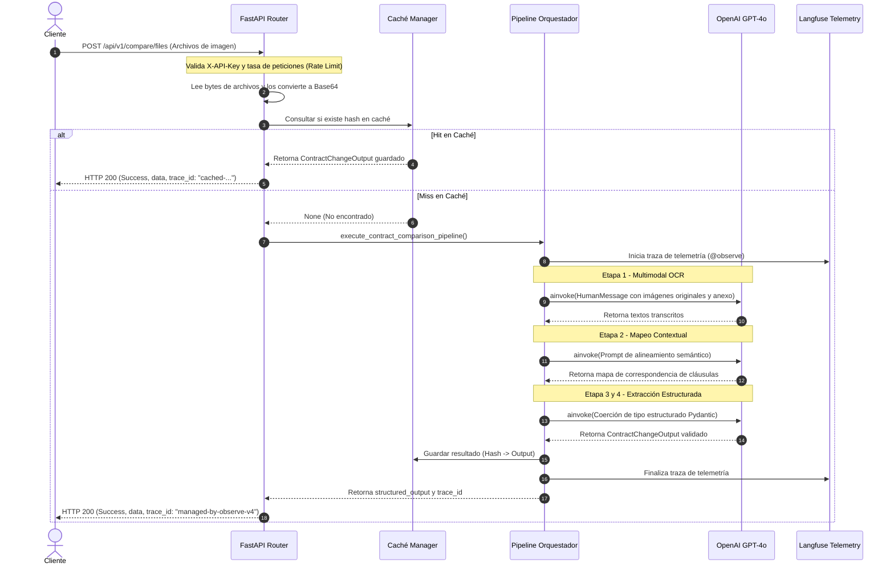

# Arquitectura del Sistema - LegalMove API

Este documento proporciona una descripción detallada de la arquitectura de software, los flujos de datos y el diseño del sistema de **LegalMove API**, un servicio backend de alto rendimiento desarrollado con **FastAPI** y diseñado para automatizar el análisis y la comparación semántica de contratos utilizando Inteligencia Artificial Multimodal (LLMs).

---

## 1. Stack Tecnológico

El sistema está construido bajo una arquitectura moderna orientada a la IA y la asincronía en Python:

*   **Framework API:** [FastAPI](https://fastapi.tiangolo.com/) (asíncrono, basado en ASGI, tipado estático con Pydantic v2).
*   **Orquestación de LLM:** [LangChain](https://python.langchain.com/) (utiliza la sintaxis declarativa LCEL `RunnableSequence`).
*   **Proveedor de IA:** [OpenAI API](https://openai.com/) (modelo `gpt-4o` multimodal para visión y extracción estructurada).
*   **Telemetría y Observabilidad:** [Langfuse](https://langfuse.com/) (seguimiento de costes, latencia y trazas de ejecución de agentes en producción).
*   **Validación y Contratos de Datos:** [Pydantic v2](https://docs.pydantic.dev/) (esquemas estrictos y coerción de tipos).
*   **Servidor ASGI:** [Uvicorn](https://www.uvicorn.org/) (servidor web de alto rendimiento).
*   **Contenerización:** [Docker](https://www.docker.com/) (entorno reproducible multipaso).

---

## 2. Arquitectura de Componentes

El diseño sigue una estructura modular orientada a servicios, dividida en cuatro capas principales:

```mermaid
graph TD
    subgraph Capa API (FastAPI)
        R[Cliente Web / Postman] -->|POST /compare| EP[app.api.endpoints]
        R -->|POST /compare/files| EP
        EP -->|X-API-Key / Accept-Language| DEP[app.api.dependencies]
    end

    subgraph Capa de Optimización y Caché
        EP -->|Buscar Caché| CA[app.services.cache]
    end

    subgraph Capa de Orquestación (LangChain)
        EP -->|Ejecutar Pipeline| PL[execute_contract_comparison_pipeline]
    end

    subgraph Capa de Agentes y Modelos
        PL -->|1. Multimodal OCR| A1[_step_multimodal_parsing]
        PL -->|2. Contextualización| A2[_step_contextualization_agent]
        PL -->|3. Extracción y Validación| A3[_step_extraction_and_validation_agent]
        A3 -->|Coerción a Esquema| SCH[app.schemas.ContractChangeOutput]
    end
    
    subgraph Observabilidad (Telemetría)
        PL -->|Trazas @observe| LF[Langfuse Dashboard]
    end
```

### A. Capa de API y Middleware (`main.py` y `app.api`)
*   **Rate Limiting Middleware:** Un limitador de peticiones en memoria mediante una ventana deslizante. Protege el pipeline de comparación (operación pesada de IA) frente a abusos de IP, mientras que permite consultas ilimitadas al endpoint `/health`.
*   **Security Headers Middleware:** Inyecta cabeceras HTTP de seguridad (`X-Frame-Options`, `X-Content-Type-Options`, `X-XSS-Protection`). Cuenta con una política de **Content-Security-Policy (CSP)** adaptativa: estricta (`default-src 'none'`) para endpoints de datos, y relajada para permitir el correcto renderizado y carga de recursos CDN en las interfaces interactivas `/docs` y `/redoc`.
*   **Endpoints:**
    *   `/health` (GET): Diagnóstico básico de estado de la aplicación.
    *   `/compare` (POST): Recibe payloads JSON con imágenes codificadas en Base64.
    *   `/compare/files` (POST): Permite cargar directamente archivos de imagen mediante `multipart/form-data`.

### B. Capa de Caché y Optimización (`app.services.cache`)
*   **Caché de Pipeline (In-Memory):** Almacena en un diccionario global y seguro el resultado estructurado de la comparación.
*   **Clave de Caché:** Genera un hash determinista `SHA256` utilizando la concatenación de los strings de entrada: `SHA256(original_b64 + addendum_b64 + language)`.
*   **Comportamiento:** Si hay un hit, retorna inmediatamente el resultado precalculado y añade el prefijo `cached-` al trace ID para análisis de rendimiento, evitando llamadas redundantes de costo y latencia al LLM.

### C. Capa de Orquestación de Agentes (`app.services.agents`)
Coordina las etapas secuenciales del pipeline mediante un flujo estructurado:

1.  **Etapa 1 - Multimodal Parsing (Vision OCR):**
    *   **Agente:** Lee las imágenes en formato Base64 del contrato original y su anexo.
    *   **LLM:** Ejecuta análisis multimodal utilizando capacidades de visión de GPT-4o para transcribir el texto exacto respetando la estructura numérica y de cláusulas.
2.  **Etapa 2 - Contextualization Agent:**
    *   **Agente:** Toma el texto transcrito de ambos documentos y construye un mapa semántico de relaciones e índices cruzados (ej. la Cláusula 4 del Original se relaciona con el Anexo Sección A).
3.  **Etapa 3 & 4 - Extraction & Validation Agent (Structured Output):**
    *   **Agente:** Compara las secciones mapeadas para identificar discrepancias, aumentos de límites, cambios de jurisdicción, etc.
    *   **Esquema Pydantic:** Aplica `.with_structured_output(ContractChangeOutput)` al LLM para garantizar que la respuesta cumpla de forma exacta con la estructura requerida (campos `sections_changed`, `topics_touched`, y `summary_of_the_change`), traduciendo al idioma solicitado por el usuario (`Accept-Language`).

---

## 3. Flujo de Datos Secuencial

El ciclo de vida de una petición para analizar dos contratos se describe en el siguiente diagrama de secuencia:



---

## 4. Aseguramiento de Calidad y Tests

El sistema implementa una suite de pruebas robusta ubicada en la carpeta `tests/` utilizando **Pytest**:

*   **Pruebas de Agentes (`tests/test_agents.py`):**
    *   Verifican el parsing OCR, la contextualización y la extracción de forma aislada.
    *   Implementa una clase mock `MockLLM` que hereda de `Runnable` para simular llamadas al LLM evitando llamadas a la API de OpenAI y garantizando compatibilidad con la sintaxis de secuencias LCEL de LangChain (`|`).
    *   Valida el comportamiento de la caché comprobando que segundas llamadas idénticas no vuelvan a invocar funciones de agentes.
*   **Pruebas de API (`tests/test_api.py`):**
    *   Verifican el endpoint `/health` y los endpoints `/compare` (JSON) y `/compare/files` (Form-data).
    *   Valida los códigos HTTP correctos (`200 OK`, `401 Unauthorized`, y `422 Unprocessable Content`).
    *   Verifica la inyección correcta de cabeceras CSP.
*   **Pruebas de Regresión (`tests/test_regression.py`):**
    *   Comprueban que el limpiado sintáctico de strings base64 (limpieza de cabeceras de URL de datos `data:image/...`) funcione correctamente.
