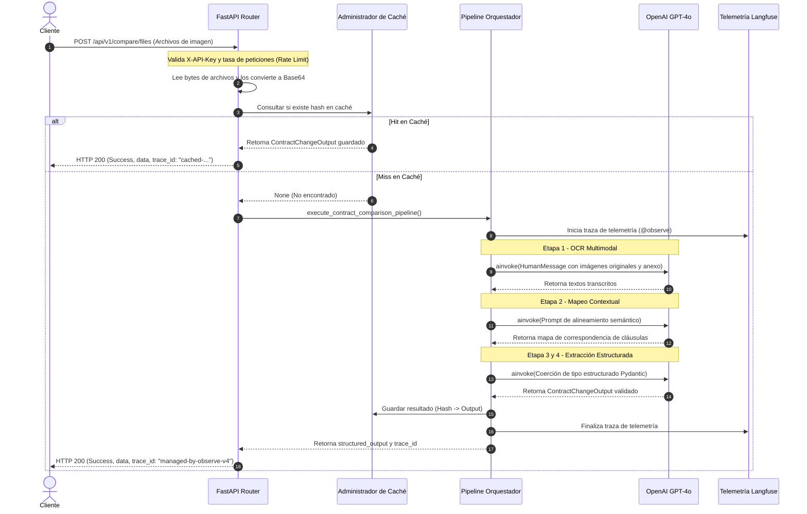
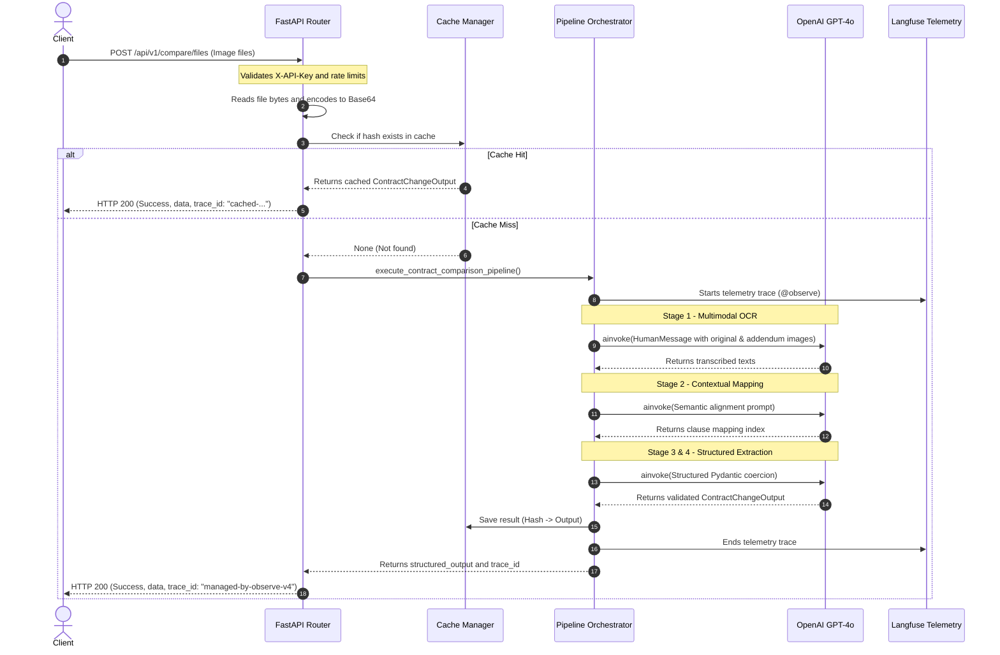

# LegalMove API - Multi-Agent Contract Comparison System

[Manual en Español](#manual-en-español) | [English Manual](#english-manual)

---

# Manual en Español

## Sistema Multi-Agente de Comparación de Contratos

LegalMove API es un servicio en FastAPI asíncrono y seguro para comparar contratos y adendas usando modelos de lenguaje multimodales (GPT-4o Vision), con validación estricta de esquemas, hardening de seguridad y traza nativa de observabilidad.

## Características de Idioma y Localización

*   **Código:** 100% escrito en inglés (variables, tipos, archivos, logs y comentarios internos).
*   **Documentación:** Bilingüe (inglés y español) a través de archivos y manuales.
*   **Resultados de la API:** En español de forma predeterminada. Configurable dinámicamente mediante la cabecera estándar HTTP `Accept-Language` (soporta español e inglés).

## Características Clave de Seguridad

1.  **Sanitización estricta de Base64:** Validador personalizado en Pydantic v2 que verifica la sintaxis de Base64 y limpia los prefijos data-URI de forma segura.
2.  **Autenticación por API Key:** Protege los endpoints POST mediante una cabecera HTTP opcional `X-API-Key`.
3.  **Cabeceras de seguridad HTTP:** Middleware personalizado que inyecta `X-Frame-Options: DENY`, `X-Content-Type-Options: nosniff` y Content-Security-Policies personalizadas.
4.  **Limitación de tasa en memoria:** Aplica límites de ventana deslizante por IP de cliente para evitar DoS.
5.  **Configuración segura de CORS:** Restringe los orígenes externos mediante validación limpia en variables de entorno.

## Flujo del Sistema (Diagrama de Secuencia)



## Estructura del Directorio

```
legalmove-api/
│
├── .env.example
├── Dockerfile
├── requirements.txt
├── main.py
│
├── app/
│   ├── __init__.py
│   ├── config.py           # Configuración analizada estrictamente mediante Pydantic Settings
│   ├── schemas.py          # Modelos de datos y validadores de Base64
│   │
│   ├── api/
│   │   ├── __init__.py
│   │   ├── dependencies.py # Dependencias de API Key e idioma de cabecera
│   │   └── endpoints.py    # Ruta POST de comparación y capturadores de errores
│   │
│   └── services/
│       ├── __init__.py
│       └── agents.py       # Pipeline de comparación de agentes LangChain con trazas de Langfuse
│
├── docs/
│   └── architecture.md     # Diagramas de flujo y diseño de arquitectura
│
├── tests/
│   ├── __init__.py
│   ├── test_api.py         # Pruebas de integración de endpoints HTTP y manejo de errores
│   ├── test_agents.py      # Pruebas unitarias con interfaces mock del LLM
│   └── test_regression.py  # Pruebas de regresión que bloquean esquemas
│
├── README.md               # Manual bilingüe (Este archivo)
└── Postman_Collection.json # Colección de solicitudes para pruebas de integración
```

## Variables de Entorno

Cree un archivo `.env` en la raíz de `legalmove-api/`:

```env
PROJECT_NAME="LegalMove API"
VERSION="1.0.0"
API_V1_STR="/api/v1"

# Seguridad de acceso mediante API Key (Opcional: dejar en blanco para desactivar)
API_KEY="super-secret-legalmove-key"

# Credenciales de OpenAI
OPENAI_API_KEY="sk-proj-XXXXXXXXXXXXXXXXXXXXXXXX"
OPENAI_MODEL_NAME="gpt-4o"

# Integración de Observabilidad con Langfuse
LANGFUSE_PUBLIC_KEY="pk-lf-XXXXXXXXXXXXXXXXXXXXXXXX"
LANGFUSE_SECRET_KEY="sk-lf-XXXXXXXXXXXXXXXXXXXXXXXX"
LANGFUSE_HOST="https://cloud.langfuse.com"

# Orígenes seguros de CORS (separados por comas, ej. "http://localhost:3000")
ALLOWED_CORS_ORIGINS="*"

# Limitación de Tasa (ej. 10 solicitudes por cada 60 segundos)
RATE_LIMIT_REQUESTS=10
RATE_LIMIT_WINDOW_SECONDS=60
```

### Generar una Clave API Segura
Puedes generar una clave criptográficamente segura usando el siguiente comando de Python:

```bash
python -c "import secrets; print(secrets.token_urlsafe(32))"
```

## Instalación Local

### 1. Configurar Entorno Python
Cree un entorno virtual e instale las dependencias:

```bash
# Crear entorno virtual
python -m venv venv

# Activar en Windows
venv\Scripts\activate

# Activar en macOS/Linux
source venv/bin/activate

# Instalar dependencias
pip install -r requirements.txt
```

### 2. Ejecutar Pruebas
Ejecute la suite de pruebas completa:

```bash
pytest tests/ -v
```

### 3. Arrancar en Local
Inicie el servidor de FastAPI:

```bash
python main.py
```
Abra [http://localhost:8000/docs](http://localhost:8000/docs) para ver la interfaz interactiva de Swagger.

## Ejecución en Docker

Este proyecto implementa una construcción Docker multi-etapa ejecutándose bajo un usuario seguro sin privilegios (`appuser`).

```bash
# 1. Construir la imagen Docker
docker build -t legalmove-api:latest .

# 2. Ejecutar el contenedor con la configuración del entorno
docker run -d \
  --name legalmove-runtime \
  -p 8000:8000 \
  --env-file .env \
  legalmove-api:latest
```

## Verificación y Postman

1. **Documentación interactiva:** Acceda a [http://localhost:8000/docs](http://localhost:8000/docs) (Swagger) o [http://localhost:8000/redoc](http://localhost:8000/redoc) (ReDoc).
2. **Verificación de estado (Health Check):** Envíe una solicitud GET a [http://localhost:8000/health](http://localhost:8000/health).
3. **Consultas manuales:** Importe `Postman_Collection.json` en Postman para probar cabeceras (`X-API-Key`, `Accept-Language`) y payloads en base64 de forma instantánea.

---

# English Manual

## Multi-Agent Contract Comparison System

LegalMove API is an asynchronous, secure FastAPI service designed to compare original contracts and addendums using multimodal Large Language Models (GPT-4o Vision), featuring strict schema validation, security hardening, and native observability tracing.

## Language Features & Localization

*   **Codebase:** 100% written in English (variables, types, files, logging, and internal comments).
*   **Documentation:** Bilingual (English and Spanish) across files and manuals.
*   **API Summaries:** Default to **Spanish**. Configurable dynamically via the standard HTTP `Accept-Language` header (supports English and Spanish outputs).

## Key Security Features

1.  **Strict Base64 Sanitization:** Custom Pydantic v2 validator checking structural Base64 syntax and cleaning data-URI prefixes safely.
2.  **API Key Authentication:** Guards POST endpoints with an optional HTTP header `X-API-Key`.
3.  **HTTP Security Headers:** Custom middleware injecting `X-Frame-Options: DENY`, `X-Content-Type-Options: nosniff`, and custom Content-Security-Policies.
4.  **In-Memory Rate Limiting:** Enforces client IP sliding window limits to prevent DoS.
5.  **Safe CORS Configuration:** Restricts external origins through clean environment validation.

## System Flow (Sequence Diagram)



## Directory Structure

```
legalmove-api/
│
├── .env.example
├── Dockerfile
├── requirements.txt
├── main.py
│
├── app/
│   ├── __init__.py
│   ├── config.py           # Configuration parsed strictly via Pydantic Settings
│   ├── schemas.py          # Data models and Base64 validators
│   │
│   ├── api/
│   │   ├── __init__.py
│   │   ├── dependencies.py # API Key and Header Language dependencies
│   │   └── endpoints.py    # Comparison POST route and error catchers
│   │
│   └── services/
│       ├── __init__.py
│       └── agents.py       # Multi-agent LangChain comparison pipeline with Langfuse tracing
│
├── docs/
│   └── architecture.md     # Flow diagrams and architecture design
│
├── tests/
│   ├── __init__.py
│   ├── test_api.py         # HTTP endpoints and error handling integration tests
│   ├── test_agents.py      # Unit tests with LLM mock interfaces
│   └── test_regression.py  # Regression tests verifying schema properties locks
│
├── README.md               # Bilingual manual (This file)
└── Postman_Collection.json # Postman integration requests collection
```

## Environment Variables

Create a `.env` file in the root of `legalmove-api/`:

```env
PROJECT_NAME="LegalMove API"
VERSION="1.0.0"
API_V1_STR="/api/v1"

# API Key Access Security (Optional: leave blank to disable)
API_KEY="super-secret-legalmove-key"

# OpenAI Credentials
OPENAI_API_KEY="sk-proj-XXXXXXXXXXXXXXXXXXXXXXXX"
OPENAI_MODEL_NAME="gpt-4o"

# Langfuse Observability Integration
LANGFUSE_PUBLIC_KEY="pk-lf-XXXXXXXXXXXXXXXXXXXXXXXX"
LANGFUSE_SECRET_KEY="sk-lf-XXXXXXXXXXXXXXXXXXXXXXXX"
LANGFUSE_HOST="https://cloud.langfuse.com"

# Secure CORS Origins (comma-separated, e.g. "http://localhost:3000")
ALLOWED_CORS_ORIGINS="*"

# Rate Limiting (e.g. 10 requests per 60 seconds)
RATE_LIMIT_REQUESTS=10
RATE_LIMIT_WINDOW_SECONDS=60
```

### Generating a Secure API Key
You can generate a cryptographically secure API key for your `.env` file using the following Python command:

```bash
python -c "import secrets; print(secrets.token_urlsafe(32))"
```

## Local Installation

### 1. Set Up Python Environment
Create a virtual environment and install dependencies:

```bash
# Create environment
python -m venv venv

# Activate on Windows
venv\Scripts\activate

# Activate on macOS/Linux
source venv/bin/activate

# Install requirements
pip install -r requirements.txt
```

### 2. Run Tests
Execute the full testing suite:

```bash
pytest tests/ -v
```

### 3. Run Locally
Start the FastAPI server:

```bash
python main.py
```
Open [http://localhost:8000/docs](http://localhost:8000/docs) to view the Swagger interactive interface.

## Running in Docker

This project implements a multi-stage Docker build running under a secure non-root user (`appuser`).

```bash
# 1. Build the Docker image
docker build -t legalmove-api:latest .

# 2. Run the container with environment configurations
docker run -d \
  --name legalmove-runtime \
  -p 8000:8000 \
  --env-file .env \
  legalmove-api:latest
```

## Verification & Postman

1.  **Interactive docs:** Access [http://localhost:8000/docs](http://localhost:8000/docs) (Swagger) or [http://localhost:8000/redoc](http://localhost:8000/redoc) (ReDoc).
2.  **Health Check:** Send a GET request to [http://localhost:8000/health](http://localhost:8000/health).
3.  **Manual Queries:** Import `Postman_Collection.json` into Postman to test headers (`X-API-Key`, `Accept-Language`) and base64 payloads instantly.
